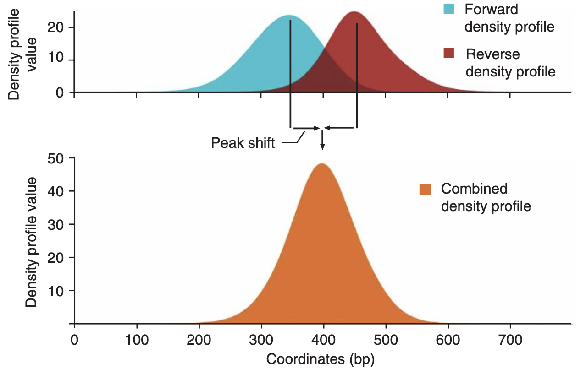
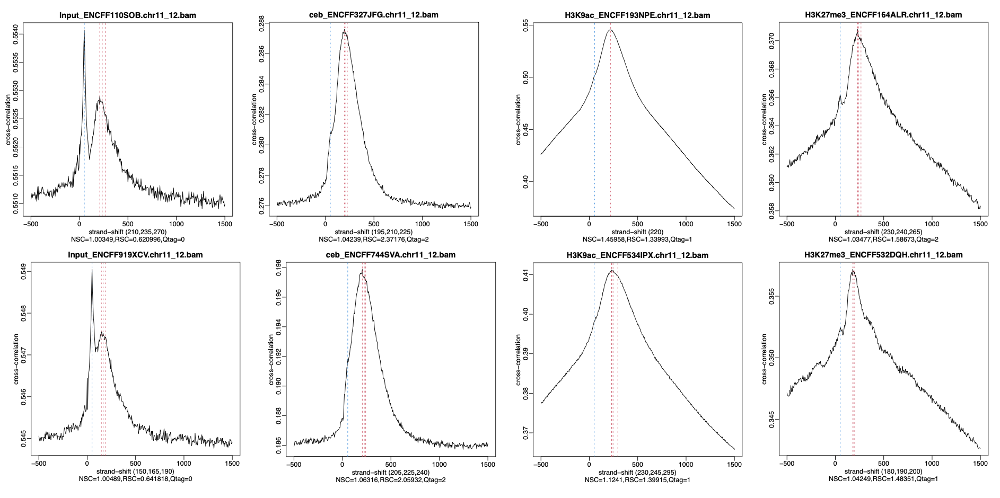
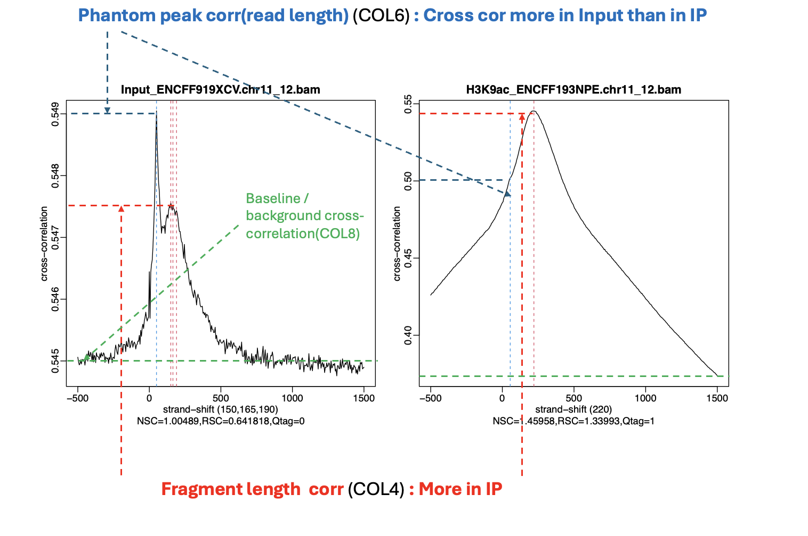

# Strand Cross-Correlation (The Echo)

`cross-correlation` `PhantomPeakQualTools` `fragment-length` `NSC` `RSC` `phantom-peak` `ChIP-seq` `quality-control` `run_spp.R` `ENCODE`

## 1: Basic Concept (The Echo)

### Why do we see two peaks?

When you do ChIP-seq, the DNA fragments are 3D objects, about 200bp long, with the protein in the middle.
However, the sequencer only reads the **Ends** of these fragments (5' ends).

* **Forward Strand Reads:** Read from the left end (Start of fragment).
* **Reverse Strand Reads:** Read from the right end (End of fragment).

This creates two piles of reads separated by the fragment length, like two mountains with a valley in between.

### The Echo Analogy

Imagine you shout **"HELLO"** (Forward Reads). A split second later, you hear the echo **"HELLO"** (Reverse Reads).

* **Cross-Correlation** is measuring exactly how long that delay is.
* We slide the Forward reads towards the Reverse reads. When they overlap perfectly, the "volume" is loudest (Max Correlation).
* The distance we slid them telling us the **True Fragment Length**.

---


*(Source:[Genome-wide analysis of transcription factor binding sites based on ChIP-Seq data](https://www.nature.com/articles/nmeth.1246)*

---

## 2: PhantomPeakQualTools

We use a tool called `run_spp.R` (part of [PhantomPeakQualTools]( https://github.com/kundajelab/phantompeakqualtools) ) to calculate this. It finds the "Best Match" distance.

### The Command

```bash
# Run PhantomPeakQualTools
Rscript /opt/anaconda3/envs/chip/bin/run_spp.R \
      -c=sample.bam \
      -savp=Sample1_spp.qc.pdf \
      -out=Sample1_spp.qc.txt
```

**Explanation:**

* `-c`: Input BAM file.
* `-savp`: Saves the diagnostic PDF plot (The "Echo" graph).
* `-out`: Output file containing the score numbers (NSC and RSC).

---

## Level 3: Analysis (Signal vs Noise)

The output plot (`Sample1_spp.qc.pdf`) usually shows TWO peaks. This is where quality control happens.

### 3.1 The Peaks

1. **The Real Peak (Red Line):**
    * **What is it?** The “Echo”. The point where Forward and Reverse reads overlap because they bind the same protein.
    * **Location:** Usually around 150-250 bp (your fragment size).
    * **Meaning:** Represents **Biological Signal**.

2. **The Phantom Peak (Blue Line):**
    * **What is it?** “Microphone Feedback”. It occurs at the **Read Length** (e.g., 50bp or 100bp).
    * **Why?** It's caused by mapping artifacts and "sticky" sequences. It happens in *every* experiment, even bad ones.
    * **Meaning:** Represents **Background Noise**.

  `Sample1_spp.qc.txt` provides numeric QC metrics in colunmns from 1-11

```
H3K9ac_ENCFF193NPE.chr11_12.bam   #1  BAM file name (input to SPP QC)
3411159                          #2  Number of reads used
220                              #3  Estimated fragment length (bp)
0.545418                         #4  Cross-correlation at fragment length
55                               #5  Phantom peak shift (bp)
0.501850                         #6  Cross-correlation at phantom peak
1500                             #7  Maximum strand shift tested (bp)
0.373681                         #8  Minimum cross-correlation (background)
1.459581                         #9  NSC – Normalized Strand Cross-correlation
1.339926                         #10 RSC – Relative Strand Cross-correlation
1                               #11 SPP quality tag (1 = good)
```

---



---

### 3.2 The Metrics (NSC & RSC)

We compare the Height of the Real Peak (Signal) to the Phantom Peak (Noise).

**Key Metrics Table:**

| Metric | Full Name | Meaning | Good Threshold |
| :--- | :--- | :--- | :--- |
| **NSC** | Normalized Strand Cross-correlation | **Signal-to-Noise Ratio.** How much higher is the Real Peak (COL4) than the flat background (COL8)? (COL4 / COL8) | **> 1.05** |
| **RSC** | Relative Strand Cross-correlation | **Signal vs Phantom.** Is the Real Peak (COL4) clearly stronger than the Phantom Peak (COL6)? ((COL4 – COL8) / (COL6 – COL8)) | **> 0.8** |

### 3.3 Interpreting the Data (Example Analysis)

---



 ---

* As shown in the plot, expectedly, the two input samples show the typical profile of unenriched DNA, with very low signal-to-noise. Their NSC values sit almost exactly at background (1.003 and 1.005), and their RSC values are only 0.62 and 0.64, which is far below what any real ChIP signal produces (NSC  > 1.05 & RSC > 0.8)

Also , `corelation values` are worth to look at :

* **Inputs (Control):**
  * The numerically high correlation values (0.5509 and 0.5474) are driven by the dominant phantom peak, not real enrichment.
* **H3K9ac (Active Mark):**
  * Correlation is **High (0.5454 and 0.4112)**.
  * **Interpretation:** Strong signal. Acetylation marks usually give huge peaks, reflecting the broad and high-coverage nature of these marks.
* **H3K27me3 (Repressive Mark):**
  * Correlation is **Medium (0.3708 and 0.3572)**.
  * **Interpretation:** Expected. Repressive marks are broad and diffuse, so the "Echo" is quieter, fitting a repressive mark that produces wide but moderate enrichment.
* **CEBPA (Transcription Factor):**
  * Correlation is **Lower (0.2876 and 0.1979)**.
  * **Interpretation:** TF peaks are sharp but rare (small % of genome). Total signal is lower, but the peaks are distinct. This is expected because TF peaks are sharp and occupy a small fraction of the genome, so their genome-wide cross-correlation values are naturally smaller.

---

## Directory Structure After Cross-Correlation QC

```text
chipseq_tutorial/
├── encode_bam/                  ← ENCODE BAM files
│   ├── ceb_ENCFF327JFG.bam
│   ├── H3K9ac_ENCFF193NPE.bam
│   └── ...                      (8 BAM files total)
├── encode_bam_qc/               ← QC metrics from section 08
│   ├── ceb_ENCFF327JFG.flagstat.txt
│   ├── ceb_ENCFF327JFG.mapq.txt
│   ├── H3K9ac_ENCFF193NPE.flagstat.txt
│   ├── H3K9ac_ENCFF193NPE.mapq.txt
│   └── ...                      (16 QC files total)
├── spp_qc/                      ← PhantomPeakQualTools outputs
│   ├── ceb_ENCFF327JFG_spp.qc.pdf
│   ├── ceb_ENCFF327JFG_spp.qc.txt
│   ├── H3K9ac_ENCFF193NPE_spp.qc.pdf
│   ├── H3K9ac_ENCFF193NPE_spp.qc.txt
│   └── ...                      (16 SPP files total)
└── sample_id.txt
```

---

## Summary

1. **Cross-Correlation** shifts reads to find the fragment length (The Echo).
2. **Phantom Peak** is a background artifact at read length (Microphone Feedback).
3. **RSC > 0.8** means your Signal (Real Peak) is louder than your Noise (Phantom Peak).

> [!NOTE]
> **Up Next:** We'll perform comprehensive QC using deepTools to validate enrichment and sample consistency before peak calling.
