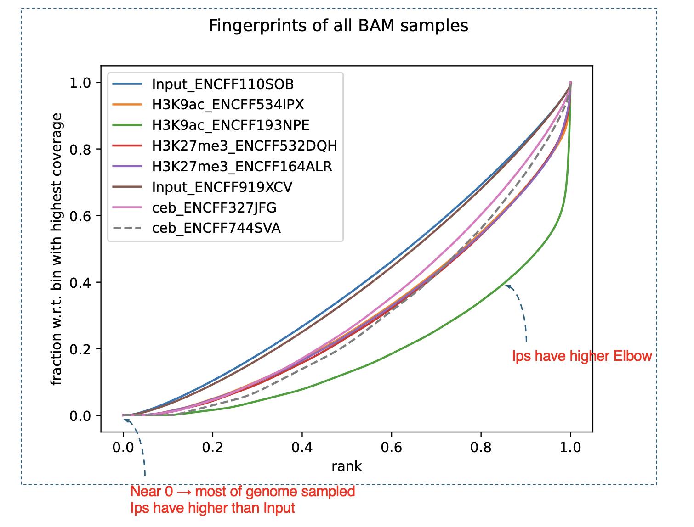
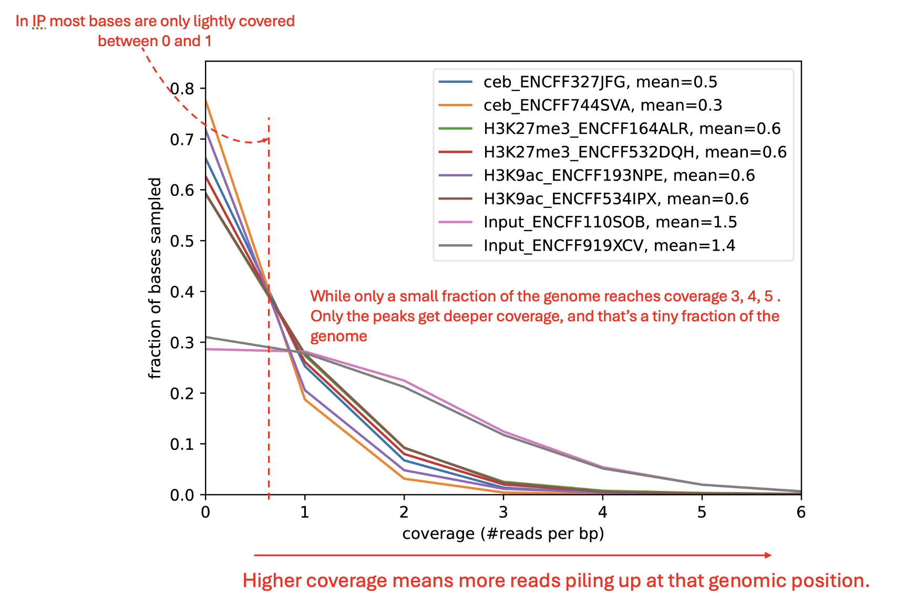
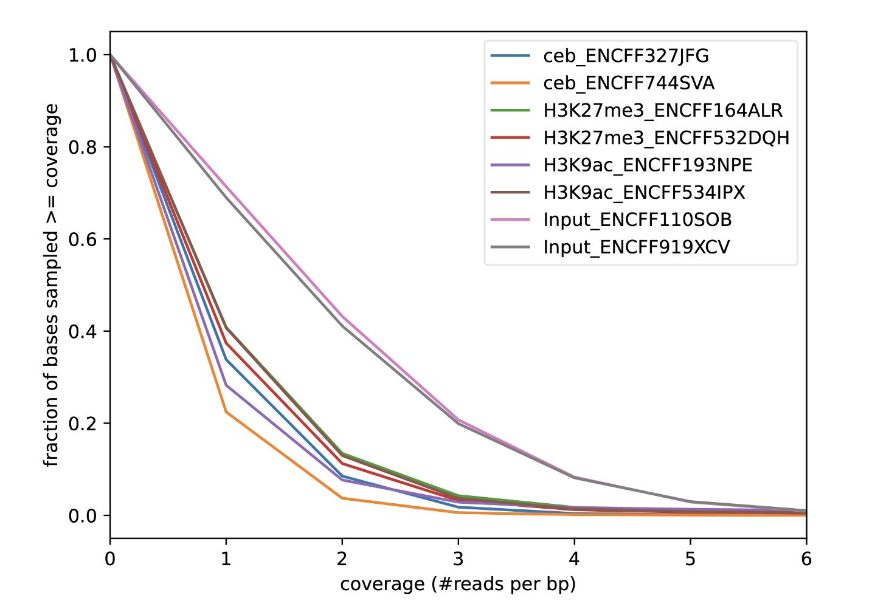
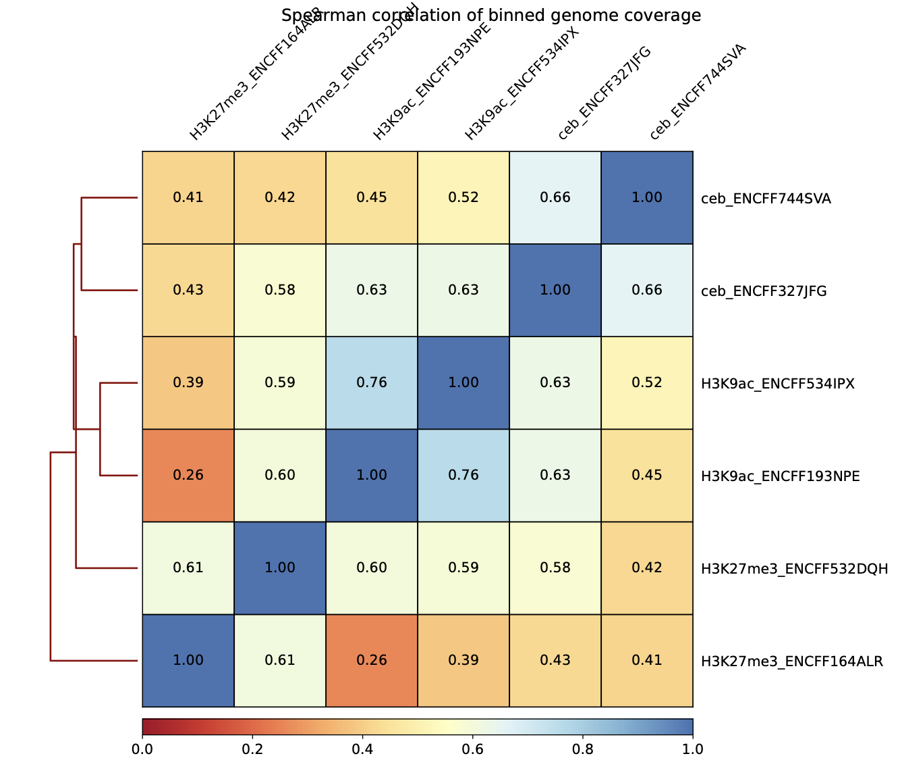

# Advanced QC with deepTools (The "Health Checkup")

`deepTools` `plotFingerprint` `plotCoverage` `multiBamSummary` `correlation` `PCA` `ChIP-seq` `quality-control` `enrichment` `BAM-QC`

## 1. Basic Concept (The Health Check)

Before we call peaks, we must perform a **Health Checkup** on our data.

* **The Census (Fingerprint):** Are the reads spread out evenly (Socialist/Input) or concentrated in specific spots (Capitalist/ChIP)?
* **The Coverage Check:** Do we have enough reads? Are they duplicates?
* **The Family Tree (Correlation & PCA):** Do biological replicates (siblings) look similar? Are they distinct from the control?

We use a suite of tools called **deepTools** to generate these reports.

---

## 2. Running the QC of bam files before Peak Calling

> [!IMPORTANT]
> **About ENCODE BAM files:** The ENCODE BAM files used in this tutorial are already pre-processed (see [Section 08](./08_bam_quality_metrics.md)). They have been deduplicated and filtered for mapping quality (MAPQ ≥ 30), meaning multimappers have been removed.

All outputs will be saved to the `deeptools_qc/` directory for organization.

### 2.1 Fingerprint Plot

**Requirements:** BAM files in `encode_bam/` directory.

```bash
# Create output directory
mkdir -p deeptools_qc

plotFingerprint \
  -b encode_bam/ceb_ENCFF327JFG.bam encode_bam/H3K9ac_ENCFF193NPE.bam encode_bam/Input_ENCFF110SOB.bam \
  --skipZeros \
  --numberOfSamples 50000 \
  -T "Fingerprints of all BAM samples" \
  --plotFile deeptools_qc/fingerprints.pdf \
  --plotFileFormat pdf \
  --dpi 600 \
  2>&1 | tee deeptools_qc/plotFingerprint.log
```

**What this does:** Samples 50,000 random genomic positions and plots cumulative read distribution to assess IP enrichment. ChIP samples should show strong enrichment (steep curve), while Input should follow the diagonal.

### 2.2 Coverage Plot

Checks sequencing depth and duplication levels.

```bash
plotCoverage \
  -b encode_bam/ceb_ENCFF327JFG.bam encode_bam/H3K9ac_ENCFF193NPE.bam encode_bam/Input_ENCFF110SOB.bam \
  -o deeptools_qc/coverage_histogram.pdf \
  --plotFileFormat pdf \
  --dpi 600 \
  --smartLabels \
  --numberOfSamples 1000000 \
  --ignoreDuplicates \
  --minMappingQuality 30 \
  --outRawCounts deeptools_qc/coverage_counts.txt
```

**What this does:** Samples 1 million genomic positions and plots coverage distribution. The `--ignoreDuplicates` and `--minMappingQuality 30` flags document expected data quality (ENCODE BAMs are already filtered, so these serve as safety checks).

### 2.3 Summary Matrix

We need a "Count Matrix" to compare samples. This counts reads in bins across the whole genome.

```bash
multiBamSummary bins \
  -b encode_bam/ceb_ENCFF327JFG.bam encode_bam/ceb_ENCFF744SVA.bam \
     encode_bam/H3K27me3_ENCFF164ALR.bam encode_bam/H3K27me3_ENCFF532DQH.bam \
     encode_bam/H3K9ac_ENCFF193NPE.bam encode_bam/H3K9ac_ENCFF534IPX.bam \  # Input BAM files (IP samples only)
  --numberOfProcessors 4 \                       # Run on 4 CPUs to speed up processing
  -o deeptools_qc/matrix.npz \                   # Output compressed matrix file (for plotting)
  --outRawCounts deeptools_qc/matrix.tab         # Output tab-separated counts file (readable text)
```

**What this does:** Divides the genome into bins and counts reads per bin for each sample, creating a matrix used by correlation and PCA analysis. We exclude Input samples to focus on comparing ChIP enrichment patterns.

### 2.4 Correlation & PCA

Using the matrix from Step 2.3, we compare the samples.

**Correlation Heatmap:**

```bash
plotCorrelation \
  -in deeptools_qc/matrix.npz \                  # Input matrix from multiBamSummary
  --corMethod spearman \                         # Use Spearman correlation (robust to outliers)
  --skipZeros \                                  # Ignore bins with zero reads
  --whatToPlot heatmap \                         # Generate a heatmap (vs scatterplot)
  --colorMap RdYlBu \                            # Color map (Red-Yellow-Blue)
  --plotNumbers \                                # Show correlation coefficients on plot
  --plotTitle "Spearman correlation of binned genome coverage" \ # Title
  --dpi 600 \                                    # High resolution for publication quality
  -o deeptools_qc/spearman_corr_plot.pdf \       # Output PDF file
  --outFileCorMatrix deeptools_qc/spearman_corr_plot.tab  # Save correlation values to text file
```

**What this does:** Computes pairwise Spearman correlation between samples using the count matrix. Biological replicates should show high correlation, and different marks/TFs should cluster separately.

**PCA (Principal Component Analysis):**

```bash
plotPCA \
  -in deeptools_qc/matrix.npz \                  # Input matrix from multiBamSummary
  -o deeptools_qc/pca.pdf \                      # Output PDF file
  -T "PCA of samples based on binned genome coverage" \ # Title
  --transpose \                                  # Transpose matrix (required for correct grouping)
  --plotWidth 14 \                               # Width of the plot in inches
  --plotHeight 12 \                              # Height of the plot in inches
  --plotFileFormat pdf \                         # File format
  --dpi 600 \                                    # High resolution for publication quality
  --outFileNameData deeptools_qc/pca.tab \       # Save PCA coordinates to text file
  --markers 's' 's' 'D' 'D' 'o' 'o' \            # Markers for each sample (pairs share markers)
  --colors  '#1b9e77' '#66c2a5' \                # Colors for ceb replicates (Green)
            '#d95f02' '#fc8d62' \                # Colors for H3K27me3 replicates (Orange)
            '#7570b3' '#8da0cb'                  # Colors for H3K9ac replicates (Purple)
```

**What this does:** Reduces high-dimensional count data to 2D for visualization. Samples should cluster by biological condition, with replicates grouping together and distinct marks/TFs separating along principal components.

**Using `sample_id.txt` for dynamic BAM file lists:**

**Requirements:** You need `sample_id.txt` file containing sample IDs (one per line, created in section 08).

```bash
# Create BAM file paths from sample IDs
BAM_FILES=$(while read sample; do echo "encode_bam/${sample}.bam"; done < sample_id.txt | tr '\n' ' ')

# Create labels from basenames (for cleaner plot labels)
LABELS=$(cat sample_id.txt | tr '\n' ' ')

# For IP samples only (excludes Input controls)
IP_FILES=$(grep -v "Input" sample_id.txt | while read sample; do echo "encode_bam/${sample}.bam"; done | tr '\n' ' ')
IP_LABELS=$(grep -v "Input" sample_id.txt | tr '\n' ' ')

# Echo commands to verify what we built
echo "All BAM files:"
echo $BAM_FILES
echo ""
echo "All labels:"
echo $LABELS
echo ""

```

**What this script does (line-by-line):**

**For all samples (`BAM_FILES` and `LABELS`):**

1. **`BAM_FILES=...`** - Reads `sample_id.txt`, loops through each sample ID, prepends `encode_bam/` and appends `.bam`, then converts newlines to spaces. Result: space-separated list of full BAM file paths.

2. **`LABELS=...`** - Reads `sample_id.txt` and converts newlines to spaces. Result: space-separated list of sample IDs (basenames) for cleaner plot labels.

**For IP samples only (`IP_FILES` and `IP_LABELS`):**

The same logic applies, but `grep -v "Input"` filters out Input control samples first, creating IP-only file and label lists for correlation/PCA analysis.

**Echo demonstrations for `BAM_FILES` and `LABELS`:**

```bash
echo "All BAM files:"
echo $BAM_FILES
echo ""
echo "All labels:"
echo $LABELS
```

**Expected output:**

```
All BAM files:

encode_bam/ceb_ENCFF327JFG.bam encode_bam/ceb_ENCFF744SVA.bam encode_bam/H3K27me3_ENCFF164ALR.bam encode_bam/H3K27me3_ENCFF532DQH.bam encode_bam/H3K9ac_ENCFF193NPE.bam encode_bam/H3K9ac_ENCFF534IPX.bam encode_bam/Input_ENCFF110SOB.bam encode_bam/Input_ENCFF919XCV.bam

All labels:
ceb_ENCFF327JFG ceb_ENCFF744SVA H3K27me3_ENCFF164ALR H3K27me3_ENCFF532DQH H3K9ac_ENCFF193NPE H3K9ac_ENCFF534IPX Input_ENCFF110SOB Input_ENCFF919XCV
```

The basenames (labels) produce cleaner plot legends compared to full file paths.

**Example usage with labels:**

```bash
# Use with plotFingerprint
plotFingerprint -b $BAM_FILES --labels $LABELS --skipZeros ...

# Use with multiBamSummary (IP samples only)
multiBamSummary bins -b $IP_FILES --labels $IP_LABELS ...
```

---

## Level 3: Reading the Charts

### [3.1 Interpreting the Fingerprint (The Census)](#21-fingerprint-plot)

This plot shows the cumulative read distribution across the genome. Good ChIP libraries show a clear separation between ChIP and input samples, with ChIP curves rising earlier due to enriched regions. Flat, overlapping curves usually indicate poor enrichment or over-background signal.

---


---

| Sample Type | Interpretation |
| :--- | :--- |
| **Input** | Close to the diagonal. Reads are uniformly distributed, behaving like ideal background. |
| **H3K9ac** | Strong "Elbow". Reads concentrated in a small fraction of bins (focal peaks), showing a strong bend away from the diagonal. |

### [3.2 Interpreting Coverage](#22-coverage-plot)

Next, we look at the overall coverage distribution in each BAM using plotCoverage. This reveals whether some samples are globally under-sequenced, dominated by a few high-coverage regions, or heavily affected by duplicated reads. We restrict to high-quality, non-duplicate reads to make the distributions comparable.

**Plot A: The Drop-off**

* **Inputs :** The Input tracks sit higher at low coverage because they spread their reads across the genome without enrichment. That’s why both Input samples show a large fraction of bases at coverage 0 and 1, then taper off more slowly as coverage increases.
  
* **ChIPs :** In contrast, every IP sample collapses more sharply; the curves drop faster after coverage 1 because most genomic positions in a ChIP experiment receive almost no reads. Only a small portion of the genome — the actual binding or modification sites — reaches deeper coverage, and that fraction is tiny enough that the tail beyond coverage 2 nearly vanishes.

---


---

**Plot B: The Tail**
Zooming in reveals the difference. Input covers more of the genome at 1x depth, while ChIP focuses on peaks. The Input curves decline more slowly because a larger fraction of their genome maintains at least some measurable coverage. The IP curves fall off earlier and more steeply, which reflects the enrichment pattern: most positions have essentially no reads, and only a very small subset of bases in true peak regions sustain higher coverage.

---



---

### [3.3 Interpreting Correlation (The Family Tree)](#24-correlation--pca)

Using the binned count matrix, we compute pairwise correlations between samples. A Spearman correlation heatmap shows whether biological replicates cluster together and whether inputs are distinct from ChIP samples. Poor clustering or scattered correlations usually indicate sample swaps, failed IPs, or inconsistent library prep.

**The Heatmap:**

* **Clustering:** H3K27me3 samples cluster together and show moderately high mutual correlations (around 0.6), which is exactly what you expect for a broad repressive mark. The H3K9ac samples also correlate strongly with each other (0.76–1.0), forming a clean sub-cluster that is distinct from H3K27me3.
* **Separation:** Active marks (H3K9ac) should look different from Repressive marks (H3K27me3).

---


---

### [3.4 Interpreting PCA](#24-correlation--pca)

Finally, we perform PCA on the same binned count matrix. PCA reduces the data to a few dimensions that capture most of the variance. In a good ChIP-seq dataset, biological replicates cluster together in PCA space, and distinct conditions or marks separate along major components. PCA is a convenient visual check for batch effects, sample swaps, and outlier libraries.

**The Map:**

* **PC1 (X-axis):** The PCA shows clear separation of samples by assay type. PC1 captures most of the variance and cleanly splits the H3K27me3 group from the H3K9ac group, which is expected because these marks have very different genomic distributions.
* **Clustering:** The two “ceb” samples cluster tightly together, indicating consistent coverage patterns within that group. The H3K27me3 replicates are also tightly paired, which matches their broad and uniform enrichment profile. The H3K9ac replicates sit on the opposite side of PC1, with one replicate shifted slightly on PC2, hinting at a mild difference in coverage distribution but nothing severe. If one replicate is far away, it might be an outlier/bad sample.

---


---

## Directory Structure After deepTools QC

```text
chipseq_tutorial/
├── encode_bam/                  ← ENCODE BAM files
│   ├── ceb_ENCFF327JFG.bam
│   ├── H3K9ac_ENCFF193NPE.bam
│   └── ...                      (8 BAM files total)
├── encode_bam_qc/               ← QC from section 08
│   └── ...
├── spp_qc/                      ← QC from section 09
│   └── ...
├── deeptools_qc/                ← deepTools outputs
│   ├── fingerprints.pdf
│   ├── plotFingerprint.log
│   ├── coverage_histogram.pdf
│   ├── coverage_counts.txt
│   ├── matrix.npz
│   ├── matrix.tab
│   ├── spearman_corr_plot.pdf
│   ├── spearman_corr_plot.tab
│   ├── pca.pdf
│   └── pca.tab
└── sample_id.txt
```

---

## Summary

1. **Fingerprint:** Confirms your IP worked (Sharp elbow).
2. **Coverage:** Confirms sequencing depth (Inputs = broad, ChIP = peaky).
3. **PCA/Correlation:** Confirms your replicates match (Siblings cluster together).

> [!NOTE]
> **Up Next:** With comprehensive QC validation complete, we're ready to call peaks with MACS2 and identify protein-DNA bindin sites.
