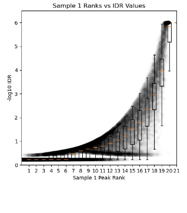
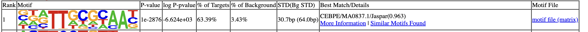

# Reproducibility Analysis - IDR, Consensus Peaks & Motif Discovery

`IDR` `reproducibility` `consensus-peaks` `motif-analysis` `HOMER` `MEME-ChIP` `ENCODE` `peak-filtering`

---

## 1. Reproducibility Analysis: IDR (Irreproducible Discovery Rate)

**IDR** (<https://github.com/nboley/idr#output-file-format>) is a statistical framework used to quantify how consistently peaks are detected between biological replicates. It was developed for large-scale functional genomics projects and is mandated by **ENCODE** for ChIP-seq reproducibility assessment.

IDR models peak rankings between replicates and estimates the probability that a peak is irreproducible noise rather than a real signal.

### Why IDR Matters

* Peaks unique to one replicate are likely noise
* Peaks present in both replicates are high-confidence
* IDR < 0.05 means peaks are reproducible

ENCODE describes [two ways](https://www.encodeproject.org/data-standards/terms/) to define reproducible peaks using IDR. The conservative approach, used here, runs IDR on true biological replicates and keeps only peaks that agree between independent experiments, giving high-confidence results. The optimal approach runs IDR on pseudoreplicates created by randomly splitting pooled data, which increases sensitivity. In this tutorial, we use the conservative approach with the biological replicates ceb_ENCFF327JFG_peaks and ceb_ENCFF744SVA_peaks.narrowPeak to focus on reproducible peaks.

### Installing IDR

**Install IDR** (if not already installed):

IDR has **binary and dependency issues on macOS ARM64**, and it is recommended to create a **dedicated environment** to avoid conflicts with other packages.

```
name: idr_env
channels:
  - conda-forge
  - bioconda
dependencies:
  - python=3.9
  - numpy=1.23.5
  - scipy=1.10.1
  - matplotlib=3.7.1
  - pip
  - pip:
      - git+https://github.com/nboley/idr.git

```

```bash
conda env create -f idr_env.yml
conda activate idr_env
```

---

## 2. Running IDR on CEBPA Replicates

```bash
idr --samples \
  macs3_results/ceb_ENCFF327JFG_peaks.narrowPeak \
  macs3_results/ceb_ENCFF744SVA_peaks.narrowPeak \
  --input-file-type narrowPeak \
  --rank signal.value \
  --output-file idr/ceb_idr_peaks.txt \
  --plot \
  --log-output-file idr/ceb_idr.log
```

**Parameter Explanation:**

* `--samples`: The two replicate peak files
* `--rank p.value`: Rank peaks by p-value (ENCODE default)
* Alternatives: `signal.value` (fold enrichment) or `q.value` (FDR)
* `--plot`: Generate diagnostic plots showing replicate concordance
* `--log-output-file`: Save detailed statistics

### Interpreting IDR Output

The output file `ceb_idr_peaks.txt` contains peaks found in both replicates with IDR scores. See the [official IDR documentation](https://github.com/nboley/idr) for complete format details.

**Key Columns:**

**Columns 1-3 (chr, start, end):** Genomic coordinates of the merged peak region where reproducible signal was detected.

**Column 5 (scaled IDR score):** Compressed 0-1000 score for ranking and visualization only (NOT for filtering). Higher values indicate better reproducibility:

* IDR = 0 → score = 1000 (perfect)
* IDR = 0.05 → score ≈ 540

**Column 7 (signalValue):** Strength of ChIP enrichment inherited from MACS3. Reflects signal intensity, not reproducibility.

**Column 11 (local IDR):** Reproducibility score for this specific peak using `-log10(IDR)` scale.

**Column 12 (global IDR):** **Primary ENCODE metric** for defining reproducible peaks across replicates, also on `-log10(IDR)` scale where higher values = better reproducibility:

* `-log10(IDR) ≥ 1.3` → IDR ≤ 0.05 (standard threshold)
* `-log10(IDR) ≥ 2.0` → IDR ≤ 0.01 (very stringent)
* Formula: `-log10(0.05) = 1.301 ≈ 1.3`

**Check peak counts at different thresholds:**

```bash
# Standard threshold (IDR ≤ 0.05)
awk '$12 >= 1.3' idr/ceb_idr_peaks.txt | wc -l

# Stringent threshold (IDR ≤ 0.01)
awk '$12 >= 2.0' idr/ceb_idr_peaks.txt | wc -l
```

---

### Filtering for Reproducible Peaks

Filter peaks that pass the standard IDR threshold:

```bash
awk '$12 >= 1.3' idr/ceb_idr_peaks.txt > idr/ceb_idr_passed.bed
```

```
# Count results

(chip) rajaishaqnabikhan@Rajas-MacBook-Pro bws % wc -l <  idr/ceb_idr_peaks.txt
    32273
(chip) rajaishaqnabikhan@Rajas-MacBook-Pro bws % wc -l <  idr/ceb_idr_passed.bed
     9468

```

**Interpretation:**

Roughly 29.3% (9,468/32,273) of initial peaks are reproducible at IDR ≤ 0.05. This is entirely reasonable for a transcription factor ChIP-seq, where we expect only the strongest, most reproducible binding sites to pass stringent filtering.

---

### Understanding IDR Diagnostic Plots

IDR generates three diagnostic plots to visualize replicate concordance:

**Plot 1: Rank Consistency Plot**


This plot displays the normalized rank of peaks in replicate 1 (X-axis) versus replicate 2 (Y-axis). Each point represents a peak shared between replicates, with black/gray points indicating reproducible peaks (IDR < 0.05) and red points showing irreproducible peaks (IDR ≥ 0.05). A strong diagonal indicates good replicate concordance, where high-ranking peaks in one replicate are also high-ranking in the other.

**Plot 2: Signal Consistency Plot**


This log10(signal)-log10(signal) plot compares signal strength between replicates, with black points representing reproducible peaks (IDR < 0.05) and red points showing irreproducible peaks (IDR ≥ 0.05). A tight diagonal band for black points confirms that strong peaks are consistently strong in both replicates, validating the biological signal.

**Plot 3: IDR vs Peak Rank**



This plot shows peak rank bins for replicate 1 (X-axis, with best peaks on the right) versus -log10(IDR) scores (Y-axis). Individual points represent peaks, with boxplots summarizing IDR distributions within rank bins. The dashed horizontal line marks the IDR = 0.05 cutoff (-log10 ≈ 1.3). A sigmoidal curve where -log10(IDR) increases sharply as peak rank improves indicates that top-ranked peaks have high reproducibility scores, which is expected for quality ChIP-seq data.

---

**Example of Poor IDR (Cross-Factor Comparison):**

This demonstrates poor IDR results when calculated between biologically unrelated samples (CEBPA replicate vs H3K9ac replicate), shown here for illustration purposes only:


## 3. Motif Analysis: Finding DNA Binding Sequences

### Why Motif Analysis Matters

Reproducible peaks answer *where* the protein binds.
Motif analysis answers *why* it binds there.

* Transcription factors bind **specific DNA sequences**
* Histone marks do **not** bind DNA directly
* Motif enrichment validates biological specificity

Example:

* **CEBPA:** sequence-specific TF
* **H3K9ac:** chromatin mark, no intrinsic motif

If a TF ChIP-seq lacks its expected motif, the experiment is suspect.

### Prerequisites

You need the **genome FASTA file** for sequence extraction:

```bash
# Download and extract genome FASTA
wget https://ftp.ebi.ac.uk/pub/databases/gencode/Gencode_human/release_49/GRCh38.primary_assembly.genome.fa.gz
gunzip GRCh38.primary_assembly.genome.fa.gz
```

## 4. Motif Discovery with HOMER

**HOMER (Hypergeometric Optimization of Motif EnRichment)** is the most widely used ChIP-seq motif discovery framework.

### Installing HOMER

> [!NOTE]
> **macOS ARM64 Users:** HOMER may require manual installation. Use the provided `install_homer.sh` script for streamlined setup.

---

### Running HOMER on IDR Peaks

```bash
# Extract genomic coordinates from IDR peaks
awk '$12 >= 1.3 {print $1,$2,$3}' OFS="\t" \
  idr/ceb_idr_peaks.txt > idr/ceb_idr_passed.bed

# Run HOMER motif discovery
findMotifsGenome.pl \
  idr/ceb_idr_passed.bed \
  GRCh38.primary_assembly.genome.fa \
  idr/cebpa_motifs/ \
  -size 200 \
  -mask \
  -p 8
```

**Parameter Explanation:**

* `idr/ceb_idr_passed.bed`: Input peak file (IDR-filtered peaks)
* `GRCh38.primary_assembly.genome.fa`: Genome assembly
* `idr/cebpa_motifs/`: Output directory for results
* `-size 200`: Search ±100bp around peak center (200bp total window)
* `-mask`: Mask repetitive DNA sequences
* `-p 8`: Use 8 CPU threads for parallel processing

### Interpreting HOMER Results

HOMER creates an output directory with:

```text
idr/cebpa_motifs/
├── homerResults.html          # Main results page (OPEN THIS)
├── knownResults.html          # Matches to known motifs
├── motif1.logo.png            # Top de novo motif
├── motif2.logo.png
└── motif1.motif               # Position weight matrix
```

**Example output from CEBPA analysis:**



**Interpreting the results:**

* **Rank (1):** Top-ranked motif, most strongly enriched among all detected sequences
* **Motif (logo):** Canonical C/EBP-family DNA-binding motif (TTGCGCAA/TTGCAT core) indicating specific TF binding
* **P-value (1e−2876):** Extreme overrepresentation in peaks vs background, statistically highly significant
* **% of Targets (63.39%):** Nearly two-thirds of peaks contain this motif, indicating coherent TF-driven peak set
* **% of Background (3.43%):** Rare in background regions, demonstrating strong specificity and enrichment
* **STD (30.7 bp vs 64.0 bp):** Motif centered near peak summits (targets) vs broadly distributed (background), supporting direct DNA binding
* **Best Match (CEBPE/MA0837.1, 0.963):** De novo motif matches known JASPAR CEBPE motif with high confidence
* **Motif File:** Provides position weight matrix for reproducibility and downstream scanning

---

## 5. Directory Structure After IDR & Motif Analysis

```text
chipseq_tutorial/
├── macs3_results/              ← Peak files from MACS3
│   ├── ceb_ENCFF327JFG_peaks.narrowPeak
│   ├── ceb_ENCFF744SVA_peaks.narrowPeak
│   └── ...
├── idr/                        ← IDR outputs
│   ├── ceb_idr_peaks.txt       # All peaks with IDR scores
│   ├── ceb_idr_passed.bed      # Filtered peaks (IDR ≤ 0.05)
│   ├── ceb_idr.log             # IDR statistics
│   └── ceb_idr_peaks.txt.png   # Diagnostic plots
└── idr/cebpa_motifs/           ← HOMER motif results
    ├── homerResults.html       # Main results page
    ├── knownResults.html       # Known motif matches
    ├── motif1.logo.png         # Top de novo motif
    └── motif1.motif            # Position weight matrix
```

---

## 6. Summary

**Key Achievements:**

1. Filtered 32,273 peaks → 9,468 reproducible peaks (29.3%) using IDR ≤ 0.05
2. Validated replicate concordance with diagnostic plots
3. Identified canonical C/EBP motif in 63% of peaks (HOMER)
4. Confirmed CEBPA specificity through motif enrichment

**Quality Indicators:**

**Good:** Strong diagonal in rank-rank plot, ~30% IDR pass rate, expected motif in >50% peaks
**Poor:** Scattered plot, <10% IDR pass rate, no motif enrichment

> [!NOTE]
> **Up Next:** Generate normalized signal tracks (BigWig files) for genome browser visualization and create publication-quality heatmaps showing enrichment patterns around genomic features.

---
