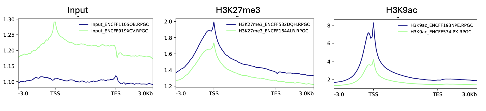

# Visualization with deepTools (Creating Signal Heatmaps)

## 1. Basic Concept (Camera Modes)

We want to visualize the "Average" pattern of our protein across all genes. To do this, we need to choose our **Camera Mode**:

1. **Portrait Mode (Reference-Point):**
    * **Focus:** One specific point (e.g., the Transcription Start Site, **TSS**).
    * **Action:** We stand at the TSS and look 3kb upstream and 10kb downstream.
    * **Use Case:** Great for seeing promoter activity (H3K9ac, Transcription Factors).

2. **Panorama Mode (Scale-Regions):**
    * **Focus:** The entire gene body.
    * **Action:** Since genes are different lengths (short vs long), we stretch or compress them all to fit the same "frame" (e.g., 5000bp).
    * **Use Case:** Great for seeing broad marks that cover the whole gene (H3K27me3, H3K36me3).

**The Process:**

1. **Prepare the Map (BED):** Define where the genes are.
2. **Create the Blueprint (Matrix):** `computeMatrix` calculates the numbers.
3. **Take the Photo (Plot):** `plotHeatmap` or `plotProfile` draws the picture.

---

## 2. The Blueprint & The Photo - Basic requirement

### Step 1: Download Reference Annotation

We need the GENCODE human genome annotation to define TSS and gene body regions.

**Download the GENCODE v49 GTF file:**

```bash
# Download GENCODE basic annotation (primary assembly)
wget https://ftp.ebi.ac.uk/pub/databases/gencode/Gencode_human/release_49/gencode.v49.primary_assembly.basic.annotation.gtf.gz

# Decompress
gunzip gencode.v49.primary_assembly.basic.annotation.gtf.gz
```

This GTF file contains comprehensive gene annotations including transcript start sites (TSS), gene bodies, and other genomic features.

### Step 2: Extract TSS Regions (Portrait Mode)

Run this `awk` script to get a 1bp position for every Transcript Start Site from the GTF:

```bash
awk 'BEGIN{OFS="\t"} $3=="transcript" {                 
  if($7=="+")                                         
    print $1, $4-1, $4, $12, ".", $7;                
  else                                               
    print $1, $5-1, $5, $12, ".", $7                 
}' gencode.v49.annotation.gtf |  
tr -d '";' |                                        
sort -k1,1V -k2,2n > tss.bed                        
```

This command extracts the **transcription start site (TSS)** for each transcript from the GTF annotation file. The script identifies whether each transcript is on the forward (+) or reverse (-) strand: for forward-strand transcripts, the TSS is the start coordinate (column 4), while for reverse-strand transcripts, it's the end coordinate (column 5).
. The output `tss.bed` is a BED file containing chromosome, TSS position (as a 1bp interval), transcript name, and strand information for every annotated transcript.

### Step 3: Extract Gene Bodies (Panorama Mode)

Run this to get the full gene intervals from the same GTF file:

```bash
awk 'BEGIN{OFS="\t"} $3=="gene" {                     
  print $1, $4-1, $5, $10, ".", $7                    
}' gencode.v49.annotation.gtf | 
tr -d '";' |                                          
sort -k1,1V -k2,2n > genes.bed
```

### Step 4: Create Output Directories

```bash
# Create directories for matrices and plots
mkdir -p deeptools_viz/matrices
mkdir -p deeptools_viz/plots
```

### Step 5: Build the Matrix (The Blueprint)

This command calculates the coverage scores for plotting.

**Mode A: Reference-Point (TSS)**

```bash
computeMatrix reference-point \
  --referencePoint TSS \
  -R tss.bed \
  -S \
    bigwigs/H3K9ac_ENCFF534IPX.bw \
    bigwigs/H3K9ac_ENCFF193NPE.bw \
  -b 3000 -a 3000 \
  --binSize 250 \
  --numberOfProcessors 4 \
  -o deeptools_viz/matrices/H3K9ac_TSS.mat.gz
```

**Mode B: Scale-Regions (Gene Body)**

```bash
computeMatrix scale-regions \
  -R genes.bed \
  -S \
    bigwigs/H3K9ac_ENCFF534IPX.bw \
    bigwigs/H3K9ac_ENCFF193NPE.bw \
  --regionBodyLength 5000 \
  -b 3000 -a 3000 \
  --binSize 250 \
  --numberOfProcessors 4 \
  -o deeptools_viz/matrices/H3K9ac_genes.mat.gz
```

### Step 6: Plotting (The Photo)

Now we turn the matrices into plots.

```bash
plotProfile \
  -m deeptools_viz/matrices/H3K9ac_TSS.mat.gz \
  --perGroup \
  -out deeptools_viz/plots/H3K9ac_TSS_profile.pdf
```

**Generating plots for all samples:**

Repeat the above `computeMatrix` and `plotProfile` commands for all your samples (Input, H3K27me3, CEBPA) to create comprehensive visualization of ChIP-seq signal patterns.

---

## Reading the Pictures

### TSS-Centered Profiles: Individual Replicates

The following plots show average ChIP-seq signal around transcription start sites (TSS ±3 kb) for individual replicates of Input, H3K27me3, and H3K9ac:

---


---

Each panel shows average signal around transcription start sites (±3 kb), and the differences between tracks are clear.

The input tracks show low, smooth signal with no sharp peak at the TSS. This is what background looks like and confirms there is no real promoter-specific enrichment in the inputs.

The H3K27me3 tracks show broader enrichment across the promoter region. The signal rises gradually toward the TSS and spreads over several kilobases, which fits a repressive chromatin mark that acts over domains rather than sharply at promoters.

The H3K9ac tracks are very different. They show strong, narrow peaks centered exactly at the TSS, with signal far higher than all other tracks. This reflects active promoter-associated acetylation and clear separation from background.

---

### TSS/TES Metagene Profiles: Genome-Wide Patterns

The following plots show average ChIP-seq signal across transcription start sites (TSS) and transcription end sites (TES):



---

The genome-wide metagene profiles show clear differences between input, CEBP, and histone marks across transcription start sites (TSS) and transcription end sites (TES).

The input tracks show low-amplitude signal with mild structure around both TSS and TES, consistent with background chromatin features and technical biases rather than true enrichment. There is no sharp localization to either boundary.

In contrast, H3K27me3 shows broad enrichment centered near the TSS that extends across the gene body and decays toward the TES. The signal is moderate in amplitude and spread over several kilobases, consistent with its role as a repressive chromatin mark acting over domains rather than forming sharp peaks.

H3K9ac displays strong, sharp enrichment precisely at the TSS, with signal levels far exceeding input and transcription factor profiles. The signal decreases steadily across the gene body and approaches baseline near the TES, consistent with promoter-focused acetylation associated with active transcription.

---

## Average Signal Analysis

These are individual replicates of the different IPs. Now let's see how they look cumulatively.

### Average BigWigs

To reduce noise and create consensus signal tracks, we average the replicate BigWig files for each mark:

```bash
# Create output directory
mkdir -p bw_mean

# Average H3K9ac replicates
bigwig Average -b bigwigs/H3K9ac_ENCFF193NPE.bw bigwigs/H3K9ac_ENCFF534IPX.bw \
  -o bw_mean/H3K9ac_mean.bw -p 6

# Average H3K27me3 replicates
bigwigAverage -b bigwigs/H3K27me3_ENCFF164ALR.bw bigwigs/H3K27me3_ENCFF532DQH.bw \
  -o bw_mean/H3K27me3_mean.bw -p 6

# Average Input replicates
bigwigAverage -b bigwigs/Input_ENCFF110SOB.bw bigwigs/Input_ENCFF919XCV.bw \
  -o bw_mean/Input_mean.bw -p 6
```

## Normalization to Input Controls

After averaging, we normalize IP signals to Input controls using log2 ratio to reveal true enrichment:

```bash
# Create output directory
mkdir -p bw_log2

# Normalize H3K9ac to Input (log2 ratio)
bigwigCompare -b1 bw_mean/H3K9ac_mean.bw -b2 bw_mean/Input_mean.bw \
  --operation log2 --pseudocount 1 -p 6 \
  -o bw_log2/H3K9ac_log2IPoverInput.bw

# Normalize H3K27me3 to Input (log2 ratio)
bigwigCompare -b1 bw_mean/H3K27me3_mean.bw -b2 bw_mean/Input_mean.bw \
  --operation log2 --pseudocount 1 -p 6 \
  -o bw_log2/H3K27me3_log2IPoverInput.bw
```

**What is pseudocount?**

The `--pseudocount 1` parameter adds 1 to all signal values before calculating the log2 ratio. This prevents two critical mathematical problems:

1. **Division by zero**: When Input signal is 0, we'd calculate log2(IP/0) which is undefined
2. **Log of zero**: When IP signal is 0, we'd calculate log2(0/Input) which is also undefined

By adding 1 to both values, we calculate `log2((IP+1)/(Input+1))` instead. This gives meaningful results even in regions with no signal while minimally affecting regions with strong signal (where adding 1 to large numbers like 100 has negligible impact).

---

## Visualization with Normalized Data

### TSS-Centered Profile with log2(IP/Input)

Create profile plots using the log2-normalized BigWig files:

```bash
computeMatrix reference-point \
  --referencePoint TSS \
  -b 3000 -a 3000 \
  --binSize 250 \
  -R tss.bed \
  -S bw_log2/H3K9ac_log2IPoverInput.bw \
  --skipZeros --missingDataAsZero \
  -p 6 \
  -o deeptools_viz/matrices/H3K9ac_TSS_log2.mat.gz

plotProfile \
  -m deeptools_viz/matrices/H3K9ac_TSS_log2.mat.gz \
  --refPointLabel TSS \
  --yAxisLabel "log2(IP/Input)" \
  --plotTitle "H3K9ac log2(IP/Input)" \
  -out deeptools_viz/plots/H3K9ac_TSS_log2_profile.pdf
```


### Gene Body Profile with Averaged Signal

Visualize signal across gene bodies using the averaged (non-normalized) BigWigs:

```bash
computeMatrix scale-regions \
  -b 3000 -a 3000 \
  --regionBodyLength 5000 \
  --binSize 250 \
  -R genes.bed \
  -S bw_mean/H3K9ac_mean.bw \
  --skipZeros --missingDataAsZero \
  -p 6 \
  -o deeptools_viz/matrices/H3K9ac_genes_mean.mat.gz

plotProfile \
  -m deeptools_viz/matrices/H3K9ac_genes_mean.mat.gz \
  --yAxisLabel "Average signal" \
  --plotTitle "H3K9ac gene-body (averaged replicates)" \
  -out deeptools_viz/plots/H3K9ac_genes_profile.pdf
```

---

## CEBPA Peak-Focused Analysis

Now, to focus on peaks identified by MACS3 and validated by IDR, we'll identify promoters overlapping CEBPA consensus peaks.

### Step 1: Identify Promoters Overlapping CEBPA Peaks

```bash
# Count total CEBPA IDR-passed peaks
wc -l ceb_idr_passed.bed
# Output: 9468 ceb_idr_passed.bed

# Find promoters that overlap with CEBPA peaks
bedtools intersect \
  -a tss.bed \
  -b ceb_idr_passed.bed \
  -u > cebpa_peak_promoters.bed

wc -l cebpa_peak_promoters.bed
# Output: 5792 cebpa_peak_promoters.bed
```

This identifies 5,792 promoters (out of all TSS) that are bound by CEBPA.

### Step 2: Create TSS-Centered Heatmap for CEBPA-Bound Promoters

```bash
# Compute matrix for CEBPA signal at CEBPA-bound promoters
computeMatrix reference-point \
  --referencePoint TSS \
  -b 2000 -a 2000 \
  -R cebpa_peak_promoters.bed \
  -S bw_log2/ceb_log2IPoverInput.bw \
  --binSize 25 \
  --skipZeros \
  -p 8 \
  -o deeptools_viz/matrices/ceb_idr_TSS.mat.gz

# Plot heatmap
plotHeatmap \
  -m deeptools_viz/matrices/ceb_idr_TSS.mat.gz \
  --colorMap RdBu_r \
  --refPointLabel TSS \
  --dpi 600 \
  -out deeptools_viz/plots/cebpa_peakPromoters_heatmap.pdf
```

### Heatmap Visualization


---

### Step 3: Chromatin State Analysis at CEBPA-Bound Promoters

**Objective:** Use the CEBPA-peak promoter bed file (`cebpa_peak_promoters.bed`) to identify enrichment of H3K9ac (active mark) and H3K27me3 (repressive mark) at CEBPA binding sites.

```bash
# Compute matrix using CEBPA-peak promoters as regions
# This shows H3K9ac and H3K27me3 enrichment at sites where CEBPA binds
computeMatrix reference-point \
  --referencePoint TSS \
  -b 2000 -a 2000 \
  -R cebpa_peak_promoters.bed \
  -S bw_log2/ceb_log2IPoverInput.bw \
     bw_log2/H3K9ac_log2IPoverInput.bw \
     bw_log2/H3K27me3_log2IPoverInput.bw \
  --binSize 25 \
  -p 8 \
  -o deeptools_viz/matrices/cebpa_multimark_TSS.mat.gz

# Profile plot: shows average enrichment across all CEBPA-bound promoters
plotProfile \
  -m deeptools_viz/matrices/cebpa_multimark_TSS.mat.gz \
  --perGroup \
  --plotTitle "CEBPA-bound promoters: Chromatin state" \
  --dpi 600 \
  -out deeptools_viz/plots/cebpa_multimark_profile.pdf

# Heatmap: shows enrichment at individual CEBPA-bound promoters
plotHeatmap \
  -m deeptools_viz/matrices/cebpa_multimark_TSS.mat.gz \
  --colorMap RdBu_r \
  --dpi 600 \
  -out deeptools_viz/plots/cebpa_multimark_heatmap.pdf
```

**What this reveals:**

* H3K9ac enrichment at CEBPA peaks indicates active chromatin
* H3K27me3 depletion at CEBPA peaks confirms absence of repressive marks
* CEBPA binds preferentially to active (H3K9ac+, H3K27me3-) promoters

---

### Profile Plot


---

### Heatmap


---

## Directory Structure After Visualization

```text
chipseq_tutorial/
├── bigwigs/                    ← Normalized BigWig files from Tutorial 14
├── bw_mean/                    ← **NEW: Averaged BigWig files**
│   ├── H3K9ac_mean.bw
│   ├── H3K27me3_mean.bw
│   └── Input_mean.bw
├── bw_log2/                    ← **NEW: Log2(IP/Input) normalized files**
│   ├── H3K9ac_log2IPoverInput.bw
│   └── H3K27me3_log2IPoverInput.bw
├── deeptools_viz/              ← **NEW: deepTools visualization outputs**
│   ├── matrices/               # Computed matrices
│   │   ├── H3K9ac_TSS.mat.gz
│   │   ├── H3K9ac_genes.mat.gz
│   │   └── cebpa_multimark_TSS.mat.gz
│   └── plots/                  # Generated plots
│       ├── H3K9ac_TSS_profile.pdf
│       ├── H3K9ac_genes_profile.pdf
│       └── cebpa_multimark_heatmap.pdf
├── tss.bed                     ← **NEW: TSS annotation (1bp positions)**
├── genes.bed                   ← **NEW: Gene body annotation**
└── cebpa_peak_promoters.bed    ← **NEW: CEBPA-bound promoters**
```

## Summary

CEBPA-bound promoters are enriched for active chromatin (H3K9ac) and depleted for repressive chromatin (H3K27me3).

---
